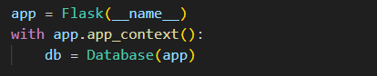

    # Docs for the db orm

questo orm nasce dalla necessitá di avere tutte i metodi *CRUD* a portata di mano senza dover ricorrere alla ripetuta scrittura di query.

le query sono sicure e protette con placeholder per prevenire *SQLI*
## 

# Funzionamento

nel file `app.py` bisognerá creare un oggetto `Database` e passargli l'app context nel costruttore per permetterli di lavorare con i dati dell'app flask e settare un file `db.env` con i parametri della connessione.

il costruttore del db mapperá ad ogni tabella del db un attributo con il medesimo nome di tipo `BaseModel` che dispone di diversi metodi

##
# Comandi

- Database
    - `GetConn()` ritorna la connessione al db
    - `GetTables()` ritorna tutte le tabelle del db in uso

- BaseModel
    - `getAll()` ritorna tutti i dati nella tabella
    - `getById()` ritorna una tupla utilizzando come metodo di ricerca un valore
    - `deleteById()` elimina una tupla utilizzando come metodo di ricerca un valore
    - `insert()` inserisce una tupla nella tabella
    - `update()` aggiorna una tupla con metodo patch o put a seconda del numero dei parametri

##
# Utilizzo

- conessione al db
   -  

Supponiamo di avere una tabella users(**username**, password)

- `db.users.getAll()` - mi ritornerá tutti gli users
- `db.users.getById(username="ciccio")` - mi ritornerá l'utente  chiamato ciccio
- `db.users.delete(username="Ciccio")` -  mi cancellerá la tupla dell'utente con username=ciccio
- `db.users.insert(username="Ciccio", password= "Ciccio"` - mi  inserira la tupla in users con i valori corrispondenti
- `db.users.update(password="Franco", WHERE="username=Ciccio")` - mi cambierá la password all'utente con username che si chiama ciccio 